## EJERCICIOS DE WIDGETS
### BUTTON
## Es un contador donde nos muestra los segundos que van pasando y lo podremos parar o reiniciar.
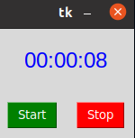
### ENTRY
## Aqui tenemos que poner nuestro usario y una contraseña y si undimos el botón aceptar la ventana se podria cerrar.
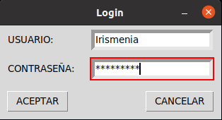
### LABEL RELOJ
## Es un reloj donde nos muestra la hora actual que tengamos contando también los segundos.
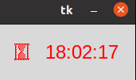
### LISTBOX
## Nos ayuda a traducir una frase o palabra a otro idioma como los que aparece en la ventana.
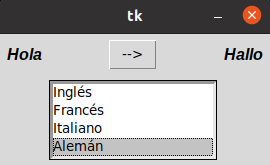
### MENU
## En está ventana podremos ver un gif que nosotros pongamos y podremos ver unas opciones que tiene la ventana
#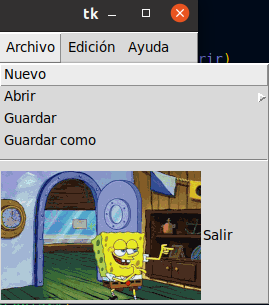
### MENU BUTTON
## Es una ventana donde podremos llenar un formulario con nuestros documentos personales. 
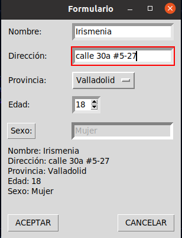
### MESSAGEBOX
## Está ventana cumple con las misma opciones que tiene la ventana llamada "MENU"
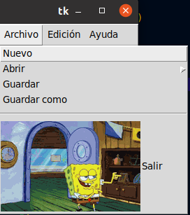
### OPTION MENU
## Esta es como munu button solo que ahora no tendremos que decir si somos hombre o mujerer lo demas seguiría igual.
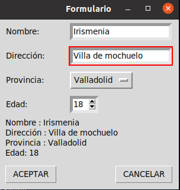
### SCALE ARCO
## Aquí podremos ver unos angulos de un circulo.
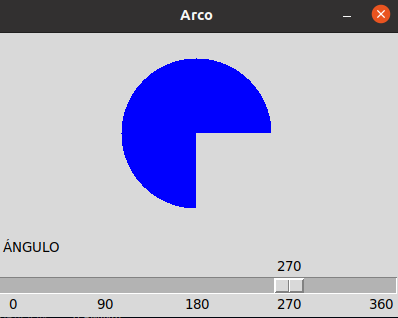
### SCROLL
## Es una ventana donde podremos escrbir pero al mismo timpo nos mostrará el gif que pusimos en el codigo.
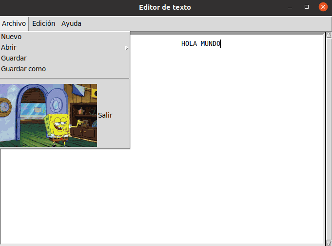
### SPINBOX
## En esta ventana tendremos que llenar un informe donde nos pediran el nombre y la edad, nuestra dirección.
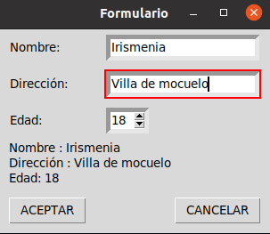
### TEXT
## Esta ventana cumple con las mismas funciones que la ventana scroll.
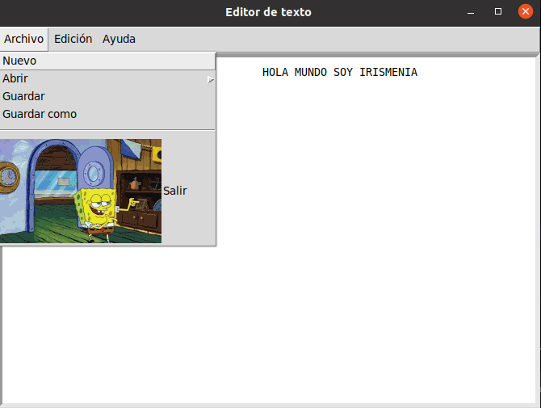
### TOPLEVEL
## En está ventana podremos ver que nos dicen en un boton aceder y nos mandara a otra ventana donde tendremos que poner un usuario y una contraseña, en la ventana principal dira abajo el nombre del usuario que hayas puesto.
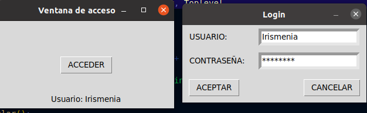