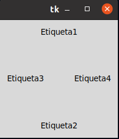
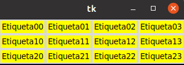
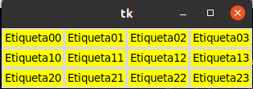
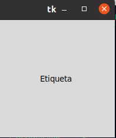

#1. POSICIONAMIENTO Y DISEÑO
## Gestor de geometría pack 
#### Este gestor de gemetría distribuye los Widgets en Horizontal o en vertical.

#### Gestor degeometría de Grid
#### Con grid la distribución de los Widgets se realiza de una manera más de flexible, utilizando un diseño de cudricula, De está manera, cada widget en la celda determinada por la intersección de una fila y una colimna.

## Gestor de geometría place
#### Este gestor permite colocar los widgets en coordenadas específicas de la ventana principal o del widget contenedor.
