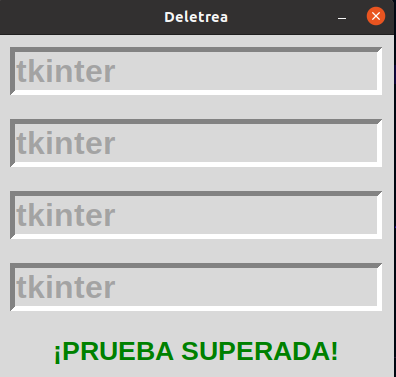
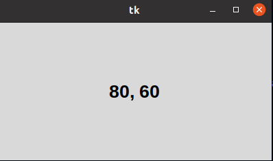
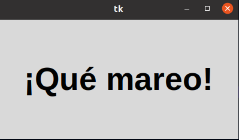

#3. METODOS_COMUNES
### METODO COMUNES FOCO
### Lo que hacemos es deletrear una frase mientras el donde vas escribiendo va rotando de puesto y sera un poco complicado, pero es de concentración.

### METODOS COMUNES RATÓN 
### En está lo que hacemos es detetar el movimiento con el eje x y el eje y, de nuestro ratón dentro de la ventana.

### METODOS COMUNES TEMPORIZADOR 
### Es una ventana donde podemos mostrar una frase que hayamos escrito y la ventana lo mostrará con un rebote o un movimiento de la ventana.
