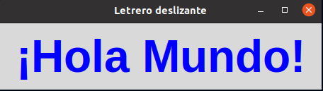

## EJERCICIOS 4 VARIABLES COMUNES
### En esta ventana podremos observar una frase que se estaria yendo hacia derecha y denpendiendo de la frase que pongamos eso va a ser lo que nos muestre la ventana.

