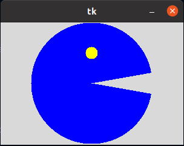
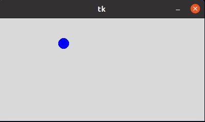
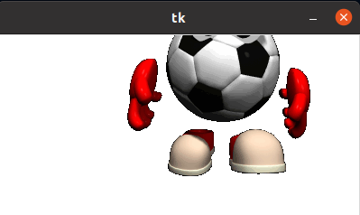
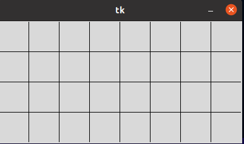
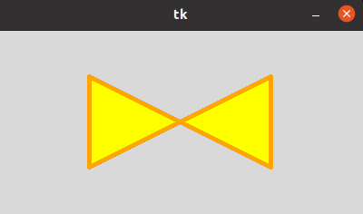
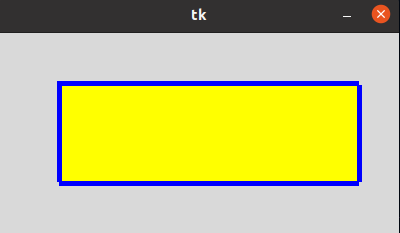
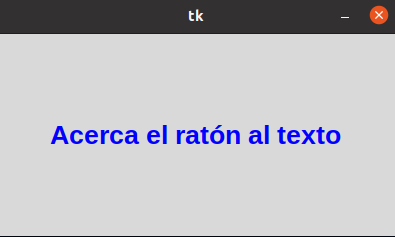

### 5 CANVAS
### CANVAS ARCO
## En está ventana nos muestra que con base a codigos nos muestra una figura que tiene movimiento, veremos el pacman.

### CANVAS CIRCULO
## En esta ventana podremos mirar el movimiento de una pelota que se mueve a diferentes lados de la ventana.

### CANVAS IMAGEN
## En está ventana podremos mirar que el gif que pongamos en los codigos saldrá en la imagen haciendo un movimiento dentro de la ventana.

### CANVAS LINEAS
## En la ventana podremos mirar unas lineas que salen dentro de la ventana.

### CANVAS POLIGONO
## En la ventana nos muestra que a base de figuras geometricas podemos hacer objeto en este caso seria un esmoqui.

### CANVAS RECTÁNGULO 
## Podremos apreciar en esta ventana una figura geometrico, ahorita veremos un rectangulo

### CANVAS TEXT
## En está podremos mirar que cuando acercamos el mouse a la frase cambia de color y también en el codigo podemos cambiar la frase

### SCALE ARCO
## Aquí podremos ver unos angulos de un circulo.